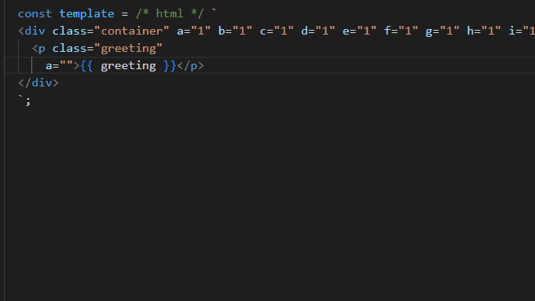

# pvts README

Helps you format html template strings more conveniently.



## Requirement
You have to use the following annotation to mark up the html
```javascript
const template = /* html */ `
  <div>hello world</div>
`;
```

> note: The start tag and end tag of the template string need to be on a separate line, due to the limitations of the current regular expression implementation.

## Usage

### Shortcuts
`alt + p`

### Command
`html template prettier`

## Prettier rulus
default:
```json
{
  "arrowParens": "always",
  "bracketSpacing": true,
  "endOfLine": "lf",
  "htmlWhitespaceSensitivity": "css",
  "insertPragma": false,
  "jsxBracketSameLine": false,
  "jsxSingleQuote": false,
  "printWidth": 80,
  "proseWrap": "preserve",
  "quoteProps": "as-needed",
  "requirePragma": false,
  "semi": true,
  "singleQuote": false,
  "tabWidth": 2,
  "useTabs": false,
  "vueIndentScriptAndStyle": false,
  "parser": "html"
}
```

> Currently not customizable :joy:

**Enjoy!**
